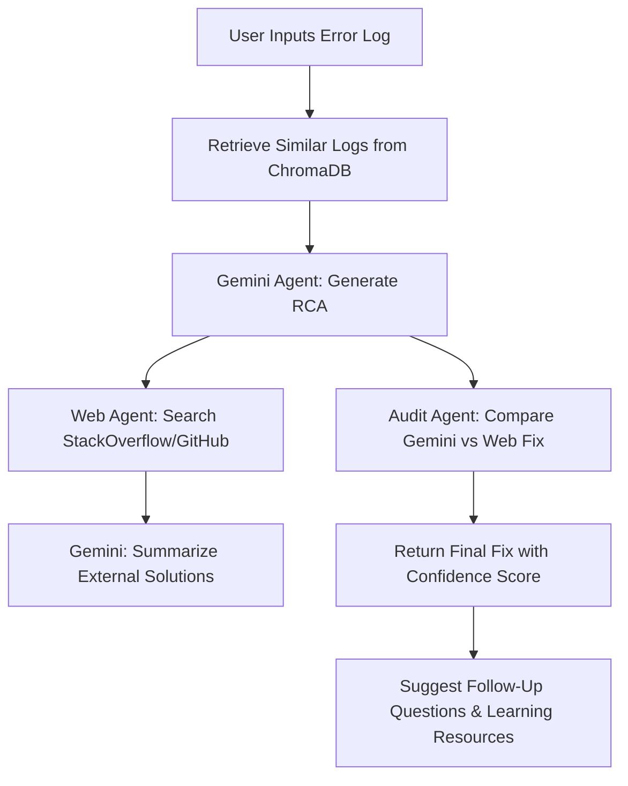

# 🧠 LogLens: A GenAI-Powered Root Cause Analysis Assistant

**LogLens** is an AI chatbot that helps engineers debug system errors from Spark, Kafka, and Airflow. It uses Google's Gemini LLM with ChromaDB vector search and web search via SerpAPI to offer short, useful explanations and suggested fixes.

---

## 🚀 Objective

Build an intelligent assistant that:
- Accepts natural language error inputs
- Retrieves relevant logs using ChromaDB
- Uses Gemini LLM to generate RCA (Root Cause Analysis)
- Audits the LLM output using live web fixes
- Returns the most confident, simplified fix to the user

---

## 🛠 Tech Stack

| Tool             | Purpose                                      |
|------------------|----------------------------------------------|
| Python           | Core programming language                    |
| Gemini 2.0 Flash | LLM for RCA and fix generation               |
| ChromaDB         | Vector store for semantic log similarity     |
| SerpAPI          | Web scraping (StackOverflow, GitHub)         |
| Kaggle Notebook  | Runtime and development platform             |

---

## 📦 How It Works



---

## 🧱 Steps in the Code

1. **Log Simulation & ChromaDB**: Generates fake Spark, Airflow, and Kafka logs and stores embeddings in ChromaDB.
2. **Gemini RCA Agent**: Takes the user error and retrieves similar logs. Gemini then explains the issue and gives 2–3 fixes.
3. **Web Search Agent**: SerpAPI fetches relevant snippets. Gemini summarizes them.
4. **Audit Agent**: Compares Gemini’s RCA vs the Web fix and gives a verdict + confidence score.
5. **Chatbot Loop**: Continues accepting user errors like a support assistant.

---

## 🧪 Running the Project

1. Upload this notebook to Kaggle or run locally.
2. Add your API keys (Google + SerpAPI) using environment variables or Kaggle Secrets.
3. Run all cells.
4. Enter your error and interact with the assistant.

---

## 📚 Example Query

**Input:**
```
org.apache.spark.shuffle.FetchFailedException: Failed to connect to host
```

**Output:**
```
Spark couldn't fetch data between workers. It might be due to memory issues or removed executors. Try increasing memory, tuning dynamic allocation, or reviewing logs.
Confidence: 0.85
```

---

## ✅ Future Additions

- Streamlit UI
- Live log ingestion via REST API
- Chat history with memory
